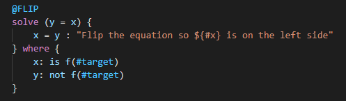

# Overview
JVMath is a modular and expandable computer algebra system (CAS) for Java.

**NOTE**: This repository was only recently made public and the documentation is not comprehensive.

# Documentation

## Table of Contents
1. [Principle of Operation](#principle-of-operation)
2. [JVMath Language](#jvmath-language)

## Principle of Operation
JVMath operates on two types of mathematical input, which are consistently referred to in this project as "expressions", which are any mathematical operations without comparison operators (=, >=, <=), and "equations", which are two expressions set equal to each other.

To operate on expressions and equations, JVMath first parses the user input into a heirarchical tree structure, where the nodes are evaluated in depth-first order. Thus, operations with a higher precedence in the order of operations will be placed deeper in the tree. Equations can be imagined as two expression trees connected at their roots by an equality operator.

To simplify expressions or solve equations, JVMath uses a set of rules that are applied successively to these trees in order to transform them to a simplified or solved state. JVMath will always solve equations such that the desired varaible is on the left side of the equation.

JVMath rules (more info in the JVMath Language section) each have an input expression or equation that they are intended to apply to. These inputs are defined in plain mathematical syntax. When attempting to apply a rule to a given expression, the rule's input expression is parsed to a tree, then JVMath attempts to map the rule's input tree onto the given expression's tree. This is a multi-step process.

The first step involves iterating through the given tree and checking for places where the rule's tree matches its **structure**. That is, the trees share the same hierarchy of operation nodes, regardless of the types of nodes that the operators are applied to or how many child nodes each operator has. A successful structural match is found when the rule tree's operator hierarchy fully matches a portion of the given tree, starting from the root node.

The second step involves a more complicated algorithm which attempts to map each variable node in the rule's tree to a node in the given tree. In the first step, JVMath stores information on what operator nodes in the rule's tree are mapped to, which is accessed in this step. In particular, all possible nodes that a variable may map to are stored and accessed here to iteratively eliminate impossible mappings and deduce one possible mapping of variable nodes to nodes in the given tree. This process is complex, but it eliminates the need for a "canonical form" used by other computer algebra systems and allows for rule to apply to a wider range of inputs.

## JVMath Language
JVMath uses a set of rules to operate on expressions and equations. The rules are defined in ```.rules``` source files. These are compiled to JSON files which are included in the JVMath JAR and read at runtime. Rules are applied in the order they are defined in the source files. Below is an example of a rule for solving an equation.



### Rule IDs
Each rule starts with an optional ID, which is denoted by @ followed by the ID. The naming convention for IDs is generally all caps with underscores. Besides being helpful for keeping track of rules by name, IDs allow rules to be referenced as follow-ups of other rules, even when they are not defined directly after the rule that references them. This feature allows different rules to apply to different starting expressions, then pass a common intermediate expression on to a follow-up rule.

### Rule Actions
Each rule has an action, which is currently either ```simplify``` or ```solve```. Rules are categorized by actions, so all ```solve``` rules are grouped together, for example.

### Rule Inputs
After the action, the input expression or equation is defined. When rules are applied to a given expresson, the first rule with an input expression that matches the given expression will be applied. If this rule references a follow up rule, then the referenced rule will be applied next. It is considered an error if the referenced rule's input expression does not match the output expression from the previous rule. When a rule is applied, the math engine attempts to apply it as many times as it can be applied in sequence before moving on.

### Rule Procedures
Following the input expression, each step for the application of the rule is defined in order, each on a separate line. If a follow-up rule is defined, the ID of the referenced rule (including the @) must be written as the last step of the rule. Each step has an optional description, which is separated from the step definition by a ```:```. Descriptions may contain text between ```${``` and ```}```, which denotes that this text should be rendered inline when presented to the user. Within these brackets, variable names preceded by ```#``` will be replaced with the variable name that the input variable maps to in the given expression. For example, if the given expression for the rule above is ```a = b``` and the user requests to solve the equation for ```b```, the step description presented to the user will read ```Flip the equation so b is on the left side```, and ```b``` will be highlighted (if the platform supports this feature).

### Rule Filters
Each rule can have an optional filter applied to the input, denoted by the ```where``` keyword. Filters allow rules to only apply to expressions that fulfill specified requirements, such as requiring variables in the input expression to be of a certain type (i.e. literal, variable), NOT a certain type, a specific value, or NOT a specific value. The currently supported filters are as follows:

Syntax|Definition
---|---
is literal | Requires the given input variable to be a literal when mapped to an expression
not literal | Requires the given input variable to **NOT** be a literal when mapped to an expression
is variable | Requires the given input variable to be a variable when mapped to an expression
not variable | Requires the given input variable to **NOT** be a variable when mapped to an expression
is = \<literal value\> | Requires the given input varaible to be both a literal **AND** be equal to the given value
not = \<literal value\> | Requires the given input varaible to be both a literal **AND NOT** be equal to the given value
is f(\<variable name\>) | Requires the given input varaible to be a function of the other specified variable
not f(\<variable name\>) | Requires the given input varaible to **NOT** be a function of the other specified variable

**NOTE**: The only currently supported variable for ```is f(<var>)``` or ```not f(<var>)``` is ```#target```, which is a reserved name that refers to whichever variable the user defines as the target varaible of a solve or simplify action. When a target is defined for a simplification, JVMath attempts to minimize the number of times that variable appears in the output expression. If a target is not given for a simplification but the rule filter requires one, that rule will not be applied.
